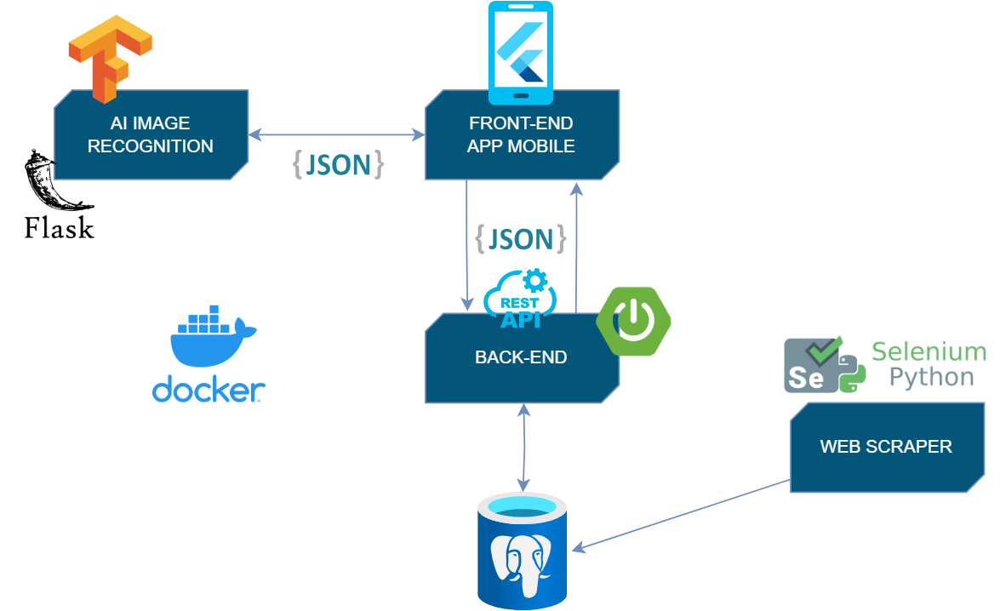

# CityWander – Smart Tourism App for Salerno

<p align="center">
  
</p>

**CityWander** is a mobile application developed during the *Enterprise Mobile Application Development* course at the University of Salerno, in collaboration with the company **ITSvil**.

It aims to offer a personalized and interactive tourism experience in Salerno, through modern technologies like geofencing, gamification, and image recognition. The app is designed to be scalable and cross-platform, supporting both Android and iOS.

---

## 🌍 Key Features

- **🎮 Gamification & Rewards**: Interactive experiences with a virtual assistant and achievement system.
- **📍 Geofencing**: Location-based content triggered in real-time.
- **📷 Image Recognition**: Restaurant and landmark identification using AI.
- **📈 Crowdfunding**: A visibility system where restaurants can promote themselves by contributing content.

---

## 🛠️ Technologies & Tools

**Main Technologies**:
- **Flutter** & **Dart** for mobile app development (cross-platform for iOS and Android).
- **Docker** for containerization and deployment.
- **GitLab** for CI/CD and code management.
- **Android** & **iOS** for mobile platforms.

**Backend**:
- **Spring Boot** & **Java** for backend development.
- **MyBatis** & **Swagger** for API handling.
- **PostgreSQL** for the database.
- **RESTful APIs** for communication between frontend and backend.

**Frontend**:
- **Figma** for UI/UX design.
- **Function12** & **Canva** for enhancing the visual experience.

**Web Scraper**:
- **Selenium** & **Python** for scraping relevant data to build the tours.
- **Geoapify** for geolocation-based services.

**AI & Image Recognition**:
- **TensorFlow**, **Keras**, & **Flask** for implementing image recognition using the ResNet50 model.

---

## 🏗️ System Architecture

<p align="center">
  
</p>

The application was developed using **Flutter 3.13.6** and is compatible with both **Android** and **iOS** devices.  
Both backends — the main backend (Spring Boot) and the image recognition service (Flask) — are fully containerized using **Docker**, making the system easily deployable and scalable across any environment.

---

### 🔧 Backend

The core backend is developed in **Spring Boot** using **Java 17**.  
It uses the **MyBatis** framework for persistence with a **PostgreSQL** database.  
The controller layer exposes **RESTful APIs**, allowing communication with the Flutter app through JSON objects.  
All API endpoints have been tested and documented using **Swagger**.

---

### 🎨 Frontend

UI mockups were designed using **Figma**, and transitioned into Flutter using **Function12**, a conversion tool that accelerated the design-to-code workflow.  
**Canva** was used for creating high-quality graphics, including assets like the illustration of *Prince Arechi*.

---

### 🕷️ Web Scraper

A Python-based web scraper was built with **Selenium** to extract restaurant data from **TripAdvisor**.  
This scraper was primarily used to populate the initial database and is capable of supporting automated submissions from restaurant owners.  
To enhance the scraped data, we used a **geocoding algorithm via Geoapify** to convert addresses into GPS coordinates.

---

### 🧠 AI Image Recognition

The app includes an **image recognition module** based on **transfer learning with ResNet50**.  
The model was fine-tuned for improved performance and can make predictions from `.jpg` input images.  
The module is deployed within a **Flask server** and integrates with the Flutter frontend:  
images are uploaded to the server, which then responds with the predicted restaurant name based on the model’s output.

---

## ⚙️ Installation Guide

### 🔙 Backend (Spring Boot + PostgreSQL)

1. Compile the backend project using **Maven** with **Java 17**:  
   Run `clean install` to generate the JAR file for deployment.

2. Start the preconfigured **Docker containers**:
   ```bash
   docker compose up -d
   ```

3. To reset containers and volumes (e.g., after changing DB init scripts):
   ```bash
   docker compose down -v
   ```

4. Access and test REST endpoints:

   - Swagger UI → [http://localhost:13004/citywanderbackend/](http://localhost:13004/citywanderbackend/)
   - PostgreSQL DB Web Admin → [http://localhost:13001/browser/](http://localhost:13001/browser/)

---

### 📱 Frontend (Flutter)

Requires **Flutter 3.13.6**.

1. Install dependencies:
   ```bash
   flutter pub get
   flutter pub upgrade
   ```

2. Run the app on an emulator or physical device:
   ```bash
   flutter run
   ```

---

### 🧠 Image Recognition Backend (Flask)

1. Make sure **Python 3.8** and all required dependencies are installed.

2. Build the Docker image:
   ```bash
   docker image build -t imagerecognition .
   ```

3. Run the container:
   ```bash
   docker run -p 5000:5000 -d --name AIRecognition imagerecognition
   ```

#### 🧪 API Testing

- **Recognize an image (GET):**
  ```
  http://localhost:5000/imageRecognition?imageName=prova1.jpg
  ```
  Example response:
  ```json
  { "recognizedImage": "Ingordo" }
  ```

- **Upload an image (POST):**

  Send a `POST` request to:
  ```
  http://localhost:5000/uploadImage
  ```
  With the image file attached in form-data as the `image` field.  
  Response: the name of the uploaded file.

---

## 📁 Repository Structure

```plaintext
CityWander/ 
├── code/ → Source code
│
├── docs/ → Documentation 
│ ├── Volantino tecnologie CityWander.png → Brochure of technologies used 
│ ├── CityWander_Presentation.pptx → Project presentation 
│ ├── CityWander_One_Minute_Shot.pptx → One-minute project summary 
│ ├── CityWander_Flyer.png → Event flyer 
│ └── docs_intermediate/ → Intermediate project documents 
│   ├── App_Challenge_Description_Interfaccia.xlsx → Challenge description 
│   ├── CityWander_Project_Proposal_ITSVIL.docx → Project proposal 
│   └── CityWander_RAD.pdf → Requirement Analysis Document 
│
├── img/ → Images used in the project 
│    └── ... → All images for presentations and demos 
│
├── app-arm64-v8a-release.apk
├── .gitignore → Git ignore file 
└── README.md → Project documentation (this file)
```
---

## 📲 Download APK

The **CityWander** app can be downloaded and installed directly on your Android device using the APK file:

- [Download CityWander APK (app-arm64-v8a-release.apk)](app-arm64-v8a-release.apk)

Simply download the APK, enable installation from unknown sources in your Android settings, and install the app to begin your personalized tourism experience in Salerno.

---

## 📄 Documentation (some documents in Italian)

- [Project Presentation (PPT)](docs/CityWander_Presentation.pptx)
- [One-Minute Project Summary (PPT)](docs/CityWander_One_Minute_Shot.pptx)
- [Technologies Used (Flyer)](docs/Volantino%20tecnologie%20CityWander.png)
- [Requirement Analysis Document (PDF)](docs/docs_intermediate/CityWander_RAD.pdf)

---

## 👥 Contributors

- [Arcangeli Giovanni](https://github.com/GiovanniArcangeli)
- Campochiaro Fabiano 
- [Di Lauro Francesco](https://github.com/NOT-FRY)
- Di Maio Marco

---

## 📄 License

This project is licensed under the [](https://creativecommons.org/licenses/by-nc-nd/4.0/).  
You may view, share and reference this work, but not modify or use it commercially without permission.

